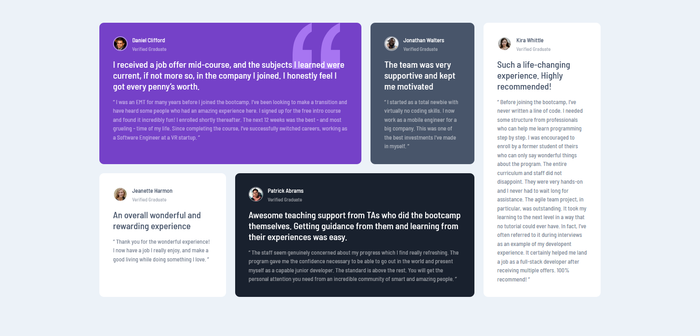

# Frontend Mentor - Testimonials grid section

This is a solution to a Frontend Mentor Challenge, a website that I use to challenge myself to learn HTML/CSS, JavaScript.
Code might not be perfect as I am still learning.

### The challenge

This is a solution to the . 
Frontend Mentor challenges help you improve your coding skills by building realistic projects. 

Users should be able to:

- View the optimal layout for the section depending on their device's screen size

### Built with

- Semantic HTML5 markup
- CSS custom properties
- Grid
- Mobile-first workflow

### Screenshot of the solution

### Live Site

- Live Site URL: (https://your-live-site-url.com)

## Author

- Linkedin - [@ChirilaAndr](https://www.linkedin.com/in/chirilaandr/)
- Frontend Mentor - [@ChirilaAndr](https://www.frontendmentor.io/profile/ChirilaAndr)
